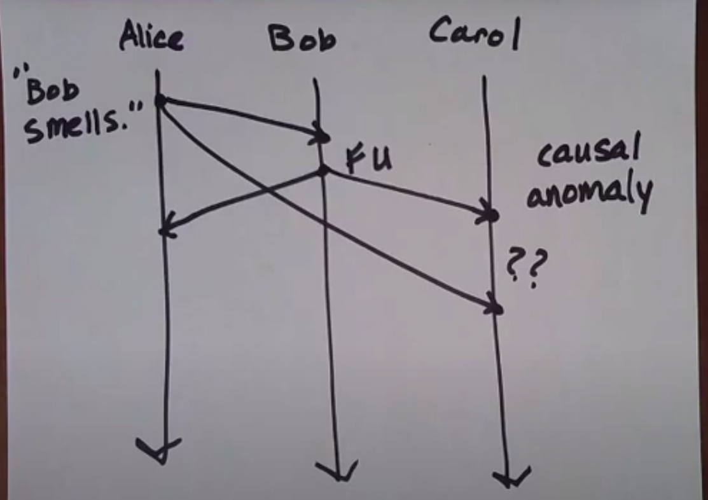
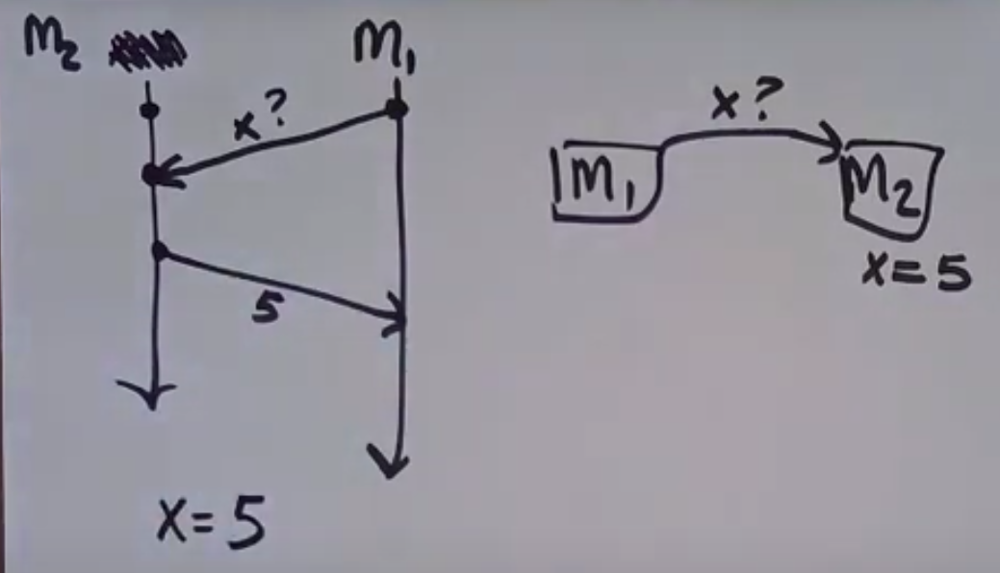
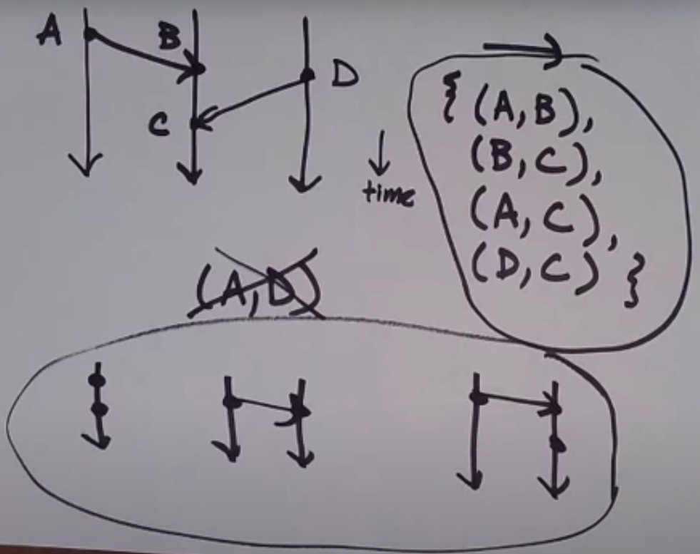
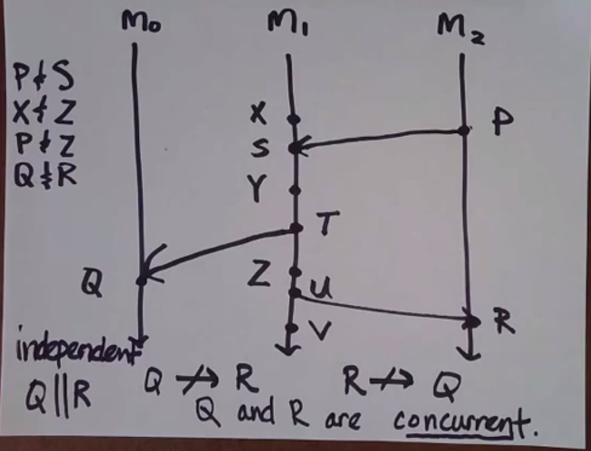
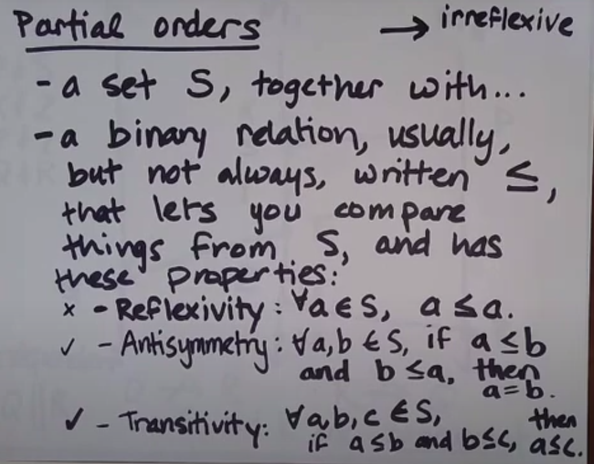

## Po co jest czas i zegary?
1. Oznaczenie konkretnego punktu w czasie (np. w poniedziałek na 8. do pracy)
2. Oznaczenie interwałów czasowych oraz czasu trwania czegoś (np. w pracy jestem 8 godzin)


## Zegar fizyczny (physical clock)

### Rodzaje zegarów fizycznych 
1. Zegar określający porę dnia (time-of-day clock) - synchronizowany z siecią poprzez protokół [NTP (Network Time Protocol)](https://en.wikipedia.org/wiki/Network_Time_Protocol)
2. Zegar monotoniczny (monotonic clock) - licznik, konkretnych odstępów czasu (np. milisekund) od pewnego momentu (np. uruchomienia maszyny). 

### Zastosowanie

1. Zegar określający porę dnia
- nie nadaje się do oznaczania interwałów oraz czasu trwania czegoś (zegar ten może redukować błędy przez synchronizację z siecią, co za tym idzie, może być cofany)
- może być wykorzystany (nie idealny) do oznaczenia konkretnego punktu w czasie (rozproszone maszyny nie muszą być dobrze zsynchronizowane)

2. Zegar monotoniczny
- dobry do określania interwałów czasowych i czasu trwania czegoś
- nie nadaje się do określania punktu w czasie (resetuje się po restarcie maszyny)

**Nie ma (jeszcze) dobrego rozwiązania dla problemu określania czasu w systemie rozproszonym.**


## Zegar logiczny
### Zastosowanie	
1. określenie kolejności zdarzeń w systemie
2. dobry do
- projektowanie systemu - umożliwia określenie, które zdarzenia następują po sobie
- debugowanie - pozwala określić, co było przyczyną wystąpienia błędu


## Problemy wynikające z trudności określenia kolejności zdarzeń w systemie rozproszonym
Anomalia przyczynowa (causal anomaly) - zdarzenie wynikowe może zostać odczytane przez maszynę, przed zdarzeniem przyczynowym (powodem może być np. nieograniczone opóźnienie (unbounded latency) na sieci)




## Modele sieci systemów rozproszonych

Do poprawnego zaprojektowania systemu musimy zdecydować w jakim modelu sieci system rozproszony będzie pracował. 

1. model synchroniczny - czas dostarczenia wiadomości jest z góry znany
2. model asynchroniczny - czas dostarczenia wiadomości jest nieznany
3. model częściowo synchroniczny - założenie, że niektóre części sieci mogą działać w modelu synchronicznym ([Lynch - Distributed algorithms](https://www.amazon.com/Distributed-Algorithms-Kaufmann-Management-Systems/dp/1558603484))


## Stan - wynik przetworzenia pewnej ilości zdarzeń



```
M1 przetworzyła n zdarzeń, czego wynikiem jest wartość x=5.
```


## Relacje między zdarzeniami
1. zdarzenie poprzedzające (happens before) - oznaczone strzałką (-->)
- zdarzenia A i B są na linii czasowej pojedynczej maszyny i A jest przed B
- zdarzenie A jest zdarzeniem wysłania, a zdarzenie B jest zdarzeniem odebrania
- zdarzenie A i C są poprzedzające, jeżeli A jest zdarzeniem wysłania, B jest zdarzeniem odebrania, a C jest zdarzeniem następującym po B na pojedynczej maszynie





2. Zdarzenia równoległe/niezależne - oznaczone dwoma liniami pionowymi (||)




## [Partial order](https://en.wikipedia.org/wiki/Partially_ordered_set#:~:text=Formally%2C%20a%20partial%20order%20is,the%20end%20of%20the%20chain).)





Relacja zdarzeń poprzedzających nie jest częściowo uporządkowana (podobno przyda się w dalszej części kursu)
