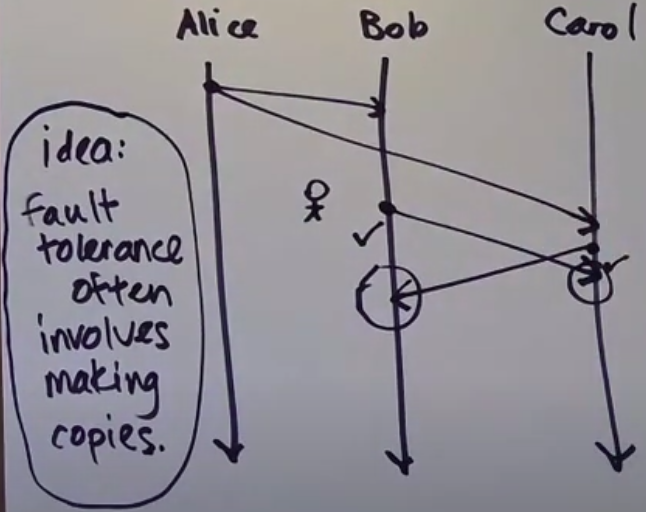

# Reliable broadcast


1. Unicast messages (one to one) - consists of one sender and one receiver
2. Broadcast messages (one-to-all) - consists of one sender and multiple receivers, everyone receive a message


3. Multicast messages (one-to-many) - consists of one sender and multiple receivers, not everyone receive a message


**Broadcast and multicast can be implemented as multiple unicasts**

## Reliable delivery

Reliable delivery definition depends on the fault model you working on.

Correct process - is a process which tolerates its fault models problems.

Relaible delivery (redux) - if the correct process P1 sends a message m to a correct process P2 and not all messages are lost, then P2 eventualy delivers m.

```
Reliable broadcast
If a correct process delivers a broadcast message m, then all correct processes deliver m
```

## How to implement reliable broadcast?

1. All prcesses keep a set of delivered messages in their local state.
2. When a process P wants to broadcast the message m
- P unicasts m to all the processes (but itself)
- P adds m to its delivered set
3. When P1 receives the message m from P2
- if m is in P1's delivered set, do nothing
- if m is not in P1's delivered set, unicasts m to all processess but P1 and P2 and add m to P1's delivered set



**Fault tolerance often involves making copies**
