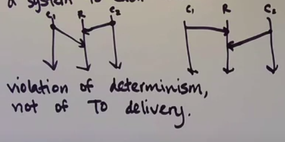
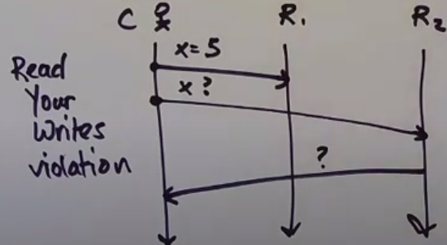
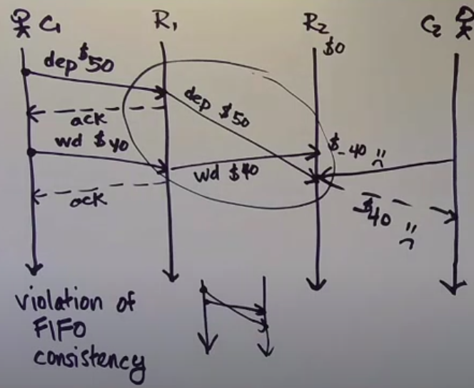
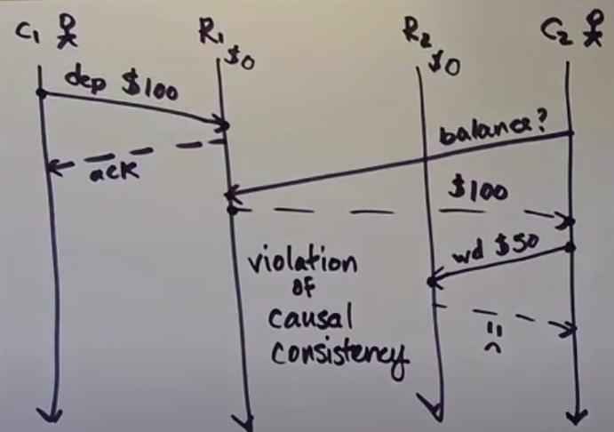
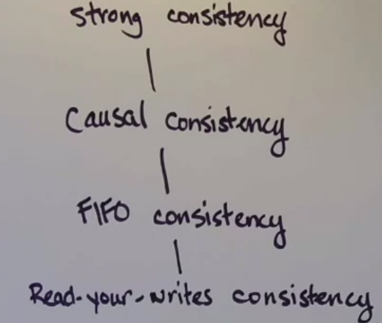

## State replication

### Reasons to do replication
1. Mitigrationg data loss (fault tolerance)
2. Data locality (you want your data to be close to you)
3. Scalability (serve more request)

### Reasons to not do replication
1. Having to keep replicas consistent is a huge problem
2. Expensive (you need more machines)

## Determinism

Relates multiple runs of a system to each other.

This is a violation of determinism, not of totally ordered delivery.

### Strong consistency

A replicated storage system is strongly consistent if clients can't tell that it's replicated.

### What can go wrong

1. Read your writes violation

2. FIFO consistency violation - FIFO anomaly between replicas

FIFO consistency - writes done by a single process are seen by all processes in the order they were issued.

3. Causal consistency violation

Causal consistency - writes that are potentially causally related (i.e. related by happens before) must be seen by all processes in the same order.

### Consistency hierarchy

