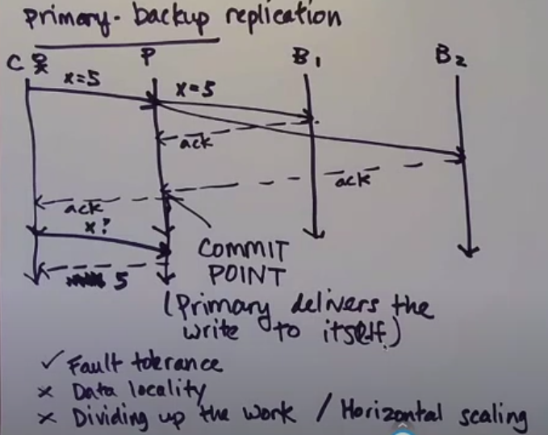
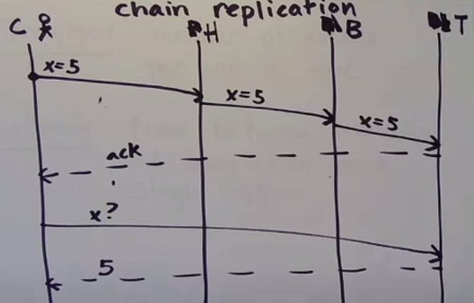

# Replication

## Strong consistency

### Primary-backup replication

One primary replica and multiple backup replicas. Client talks only with primary replica.

Fault tolerant - if primary replica crashes backup replica replaces it. There could be a problem that backup replica has future writes which haven't been commited by primary backup. 

To make it easier for client to use replicas, we can use coordinator process which contains information about replicas.

### Chain replication

"Chain Replication for supporting high throughout and availability", von Renesse and Schneider, 2004

Throughput - number of actions per unit of time
Latency - time between invocation and complition of a single action

To make it easier for client to use replicas, we can use coordinator process which contains information about replicas.

**Chain replication has the biggest improvement over primary-backup replication when 10-15% of requests are writes**

## Coordinator

To get strong consistency we need to use multiple replicas of coordinators. We have to use a consensus algorithm to make them consistent.