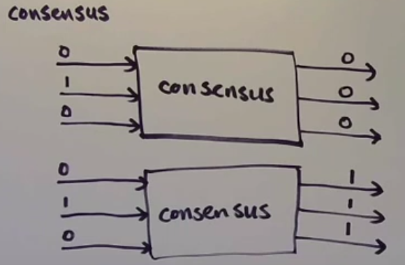
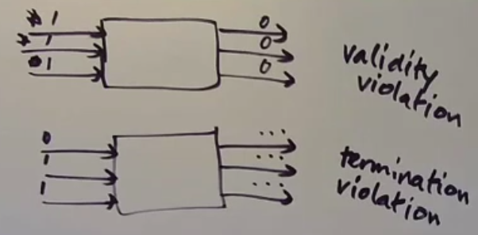
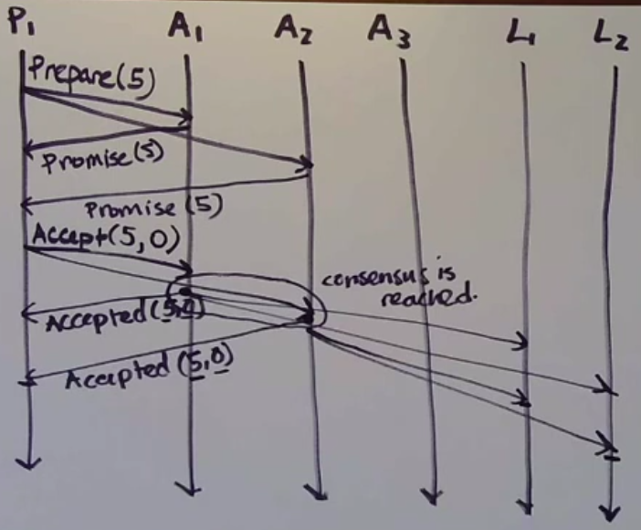

# Consensus



## Problems in distributed system

1. <strong>The atomic broadcast/the totally ordered broadcast problem</strong> - you need to make sure processes deliver the same messages in the same order 
2. <strong>The group membership problem/failure detection problem</strong> - you need all processess to know which of them exist and are running
3. <strong>The leader election problem</strong> - you want one process to play a distinguished role  (and you want other processes to know about it)
4. <strong>The distributed mutual exclusion problem</strong> - you want processes to take turns getting mutually exclusive access to some resoource
5. <strong>The distributed transaction commit problem</strong> - all processes are participating in a transaction and you need them to agree on whether it's committed/aborted

## Consensus algorithm properties

1. Termination - each correct process eventually decides on a value
2. Agreement - all correct processes agree on the <strong>same</strong> value
3. Validity/Integrity/Nontriviality - the agreed-upon value must be one of the proposed values

```
It's impossible to satisfy all 3 in the async network model and crash fault model.

'FLP' - Michael Fischer, Nancy Lynch, Michael Paterson, 1983
```

The best choice is to compromise on termination. The problem is that, we can not get an answere at all.



## Paxos
In paxos process can play one of the role

1. Proposer - propose values
2. Acceprtor - contribute to a decision from among the proposed values
3. Learner - learn the agreed-upon value

### Algorithm

1. When an acceptor gets a Prepare(n) message, it asks
- did I previously promise to ignore requests with this proposal number?
    - if yes, ignores it
    - if no, it now promises to ignore any requests with a proposal number lower than n, and replies to the proposer with a Promise(n) message (*simplification - will come back to this)
2. Once a proposer has received Promise(n) messages from particular proposal number x from a majority of acceptors
- it sends on Accept(n, val) messages to a majority of acceptors, where n is the proposal number that was promised and val is the actual value it wants to propose(**will come back to this too)





