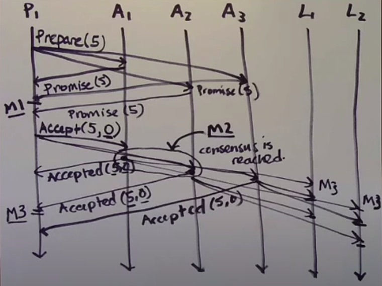
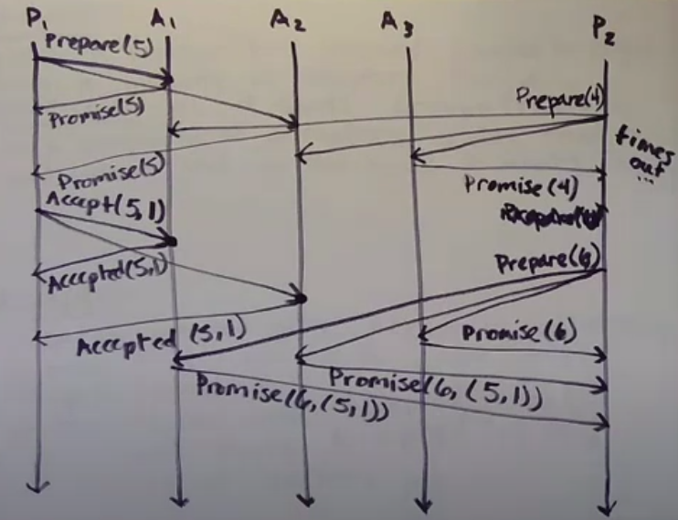
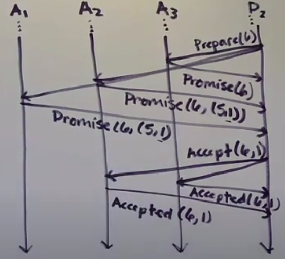

## Paxos

### Milestones
1. A majority of acceptors have promised a particular proposal number
2. A majority of acceptors send Accepted message for particular proposal number n and the particular value - consesus has been reached even nobody knows it yet
3. Proposer or learner gets an Accepted message from a majority of acceptors for particular proposal number n. That's when they know the consensus has been reached on the value

## Algorithm steps

### Proposer
Sends Prepare(n) to a majority of acceptors.
n has to be 
- unique
- higher than any proposal number that <strong>that proposer</strong> has tried before

### Acceptor
When it receive a Prepare(n), it asks
- Did I previously promise to ignore requests with this proposal number?
    - if yes, ignore it
    - if no, it asks "have I previously accepted anything"?
        - if no, replies to proposer with Promise(n), which means "I promise to ignore requests with proposal number lower than n"
        - if yes, responds with Promise(n, (nprev, valprev))

### Proposer
When a proposer has recieved Promise messages from a majority of acceptors for a particular n, it sends Accept(n, val) message to majority of acceptors, with that n and where val is chosen as follows
- if the proposer has gotten any (nprev, valprev) pairs, it must to choose the valprev that went with the highest nprev
- otherwise, it can pick the value it wants

### Acceptor
When an accpetor gets Accept(n, val) message, it asks

- Did I previously promise to ignore requests with this proposal number?
    - if yes, ignore it
    - if no, replies with Accepted(n, val) message and sends Accepted(n, val) to all the learners

**Images doesn't contain learners to simplify them.**

