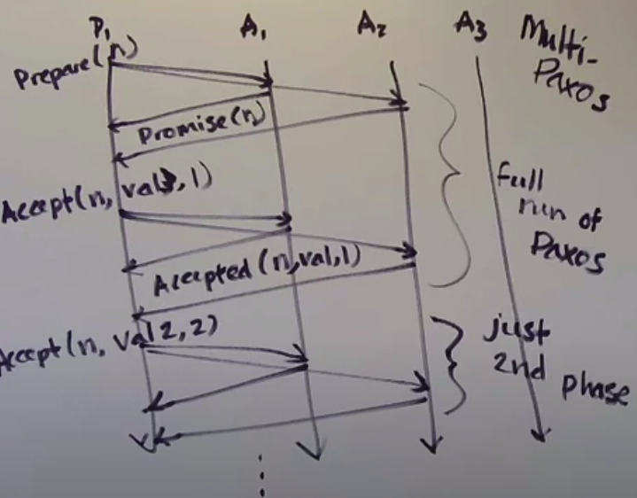

Totally-ordered broadcast boils down to repeated consensus on single values

## Multi-paxos



## Fault tolerance

1. Crash fault

How many acceptors can crash? 

A minority. If f is the number of acceptor failures you want to tolerate you need 2f+1 acceptors

How many proposers can crash?

All but one. You need f+1 proposers

2. Omission fault

Paxos behaviour under omission faults should be fine.

## Other consensus protocols for sequence of values

1. Viewstamped Replication (VSR) - Brian Oki & Barbara Liskov, 1988
2. Zookeeper atomic broadcast (zab) - Yahoo Reaserch, late 2000
3. Raft - Diego Ongara & John Oustarhout, 2014

Consensus protocols comparison - Vive la Difference by van Renesse, Schiper and Schneider, 2014

## Active & Passive Replication

1. Active replication (state machine replication) - actually execute an operation on every replica

```
i.e.
Primary replica handles the message Deposit(50) and sends that message to every backup replica.
```

2. Passive replication - one replica executes the operation and sends state update to the others

```
i.e.
Primary replica handles the message Deposit(50) and sends the message with the information about a new account balance.
```

If the computation is expensive or it depends on the local state, it's better to use passive replication.

