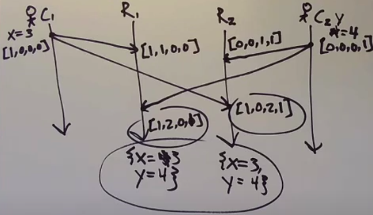
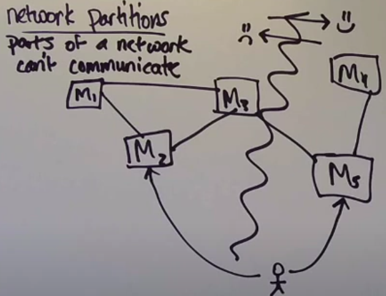
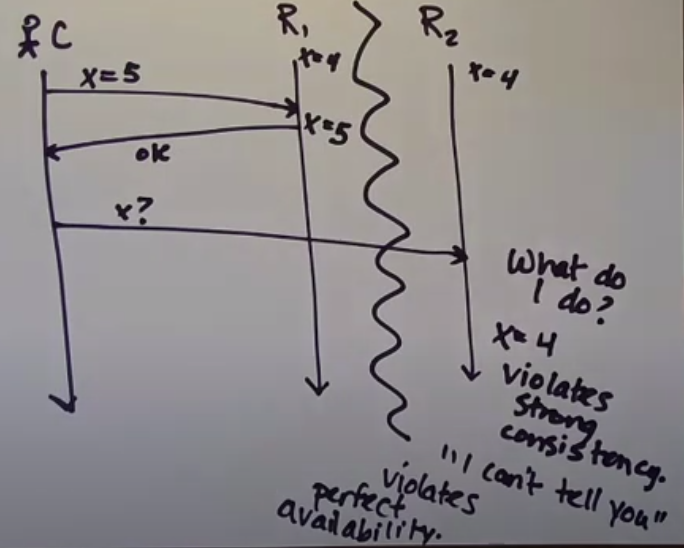
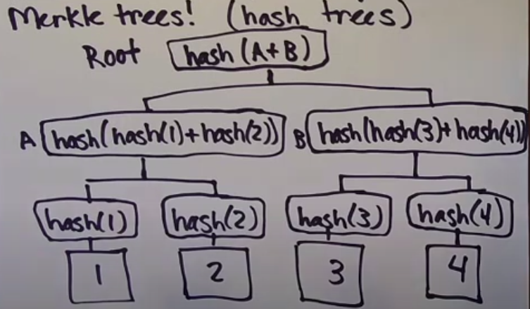
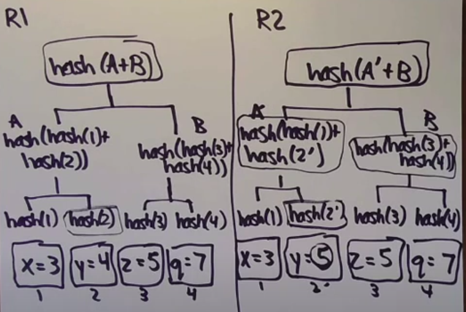

```
Dynamo: Amazon’s Highly Available Key-value Store 
Giuseppe DeCandia, Deniz Hastorun, Madan Jampani, Gunavardhan Kakulapati,
Avinash Lakshman, Alex Pilchin, Swaminathan Sivasubramanian, Peter Vosshall
and Werner Vogels 
```

## Eventual consistency

Eventual consistency - liveness property, replicas eventually agree if client stop submitting updates

Strong convergence - safety property, replicas that have delivered the same set of updates have equivalent state

Strong eventual consistancy is a combination of eventual consistency and strong convergence. Safety + liveness property

### Examples 

1. Clients mutate different states



2. Replicas deliver set of changes on state instead of only state. 
Clients have to decide what to do with all events (i.e. shopping card)


## Network partitions

Nodes in one part of a network can't reach nodes in another part (temporary and unintentional)

1. Machines cannot communicate between groups
2. Client can communicate with machines, but they cannot communicate with eachother
3. One group of machines can send messages to the second one, but the second one cannot send messages to the first one



## Availability

Perfect availability - every request receives a meaningful response within some time limit



## CAP

```
CAP - strong Consistency, perfect Availability, Partition-tolerance

You can't have all three
```

## Anti-entropy
- resolving confilcts in replica application state
- replicas randomly contact other replicas at a regular interval to find out their state (key-value pairs)

## Gossip
- resolving conflicts in the view of membership (who is up and running)

## How to minimize the cost of data transfer during replica synchronization?

1. Merkle trees (hash trees)



Example 

Replicas send only hashes of roots. If they differ, replicas send hashes of child nodes until they find different states. Then replicas send only the states that differ.



**Merkel trees are especially useful in the situation where you expect the replicas to be mostly caught up with one another**

