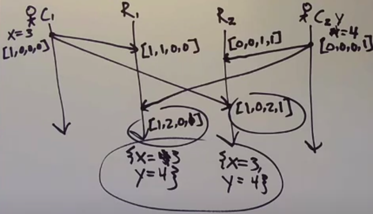
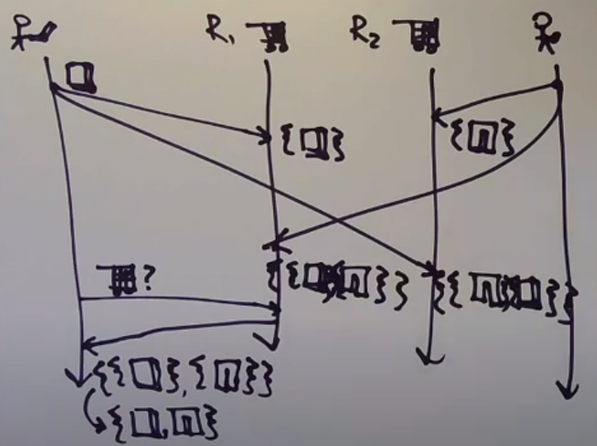
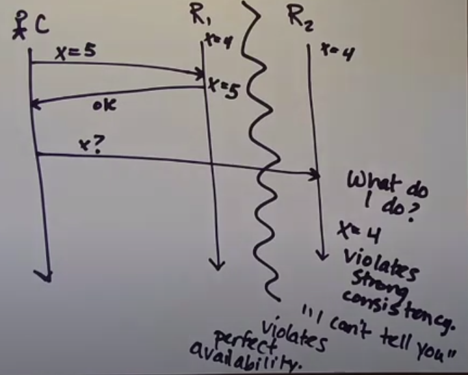

```
Dynamo: Amazon’s Highly Available Key-value Store 
Giuseppe DeCandia, Deniz Hastorun, Madan Jampani, Gunavardhan Kakulapati,
Avinash Lakshman, Alex Pilchin, Swaminathan Sivasubramanian, Peter Vosshall
and Werner Vogels 
```

## Eventual consistency

Eventual consistency - liveness property, replicas eventually agree if client stop submitting updates

Strong convergence - safety property, replicas that have delivered the same set of updates have equivalent state

Strong eventual consistancy is a combination of eventual consistency and strong convergence. Safety + liveness property

### Examples 

1. Clients mutate different states



2. Replicas deliver set of changes on state instead of only state. 
Clients have to decide what to do with all events (i.e. shopping card)



## Network partitions

Problems with network

1. Machines cannot communicate between groups
2. Client can communicate with machines, but they cannot communicate with eachother
3. One group of machines can send messages to the second one, but the second one cannot send messages to the first one


## Availability

Perfect availability - every request receives a response



## CAP

```
CAP - strong Consistency, perfect Availability, Partition-tolerance

You can't have all three
```

