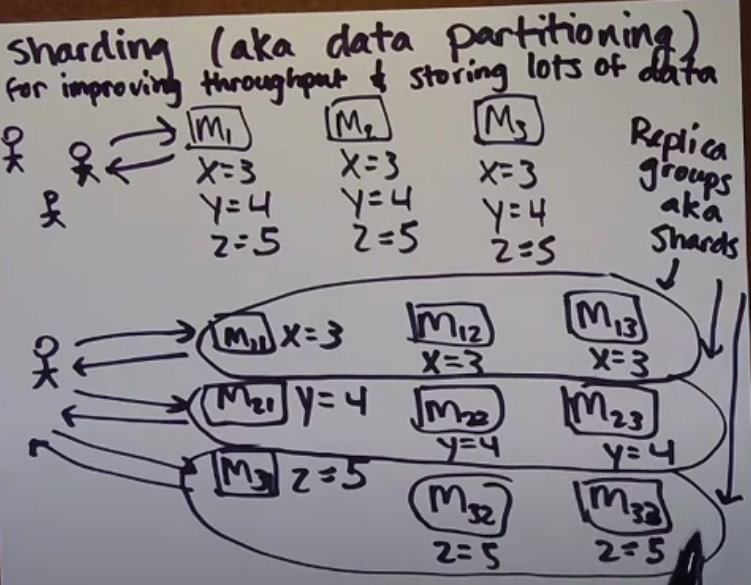
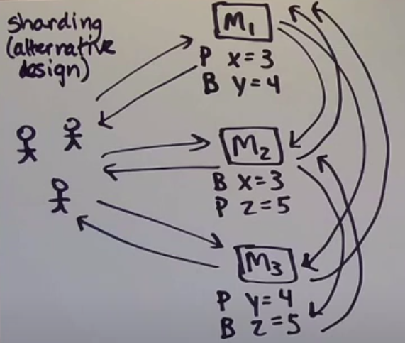
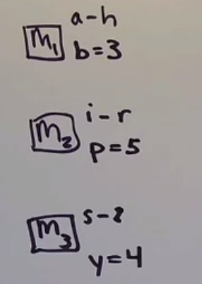
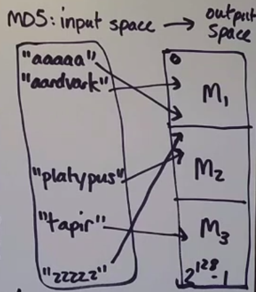
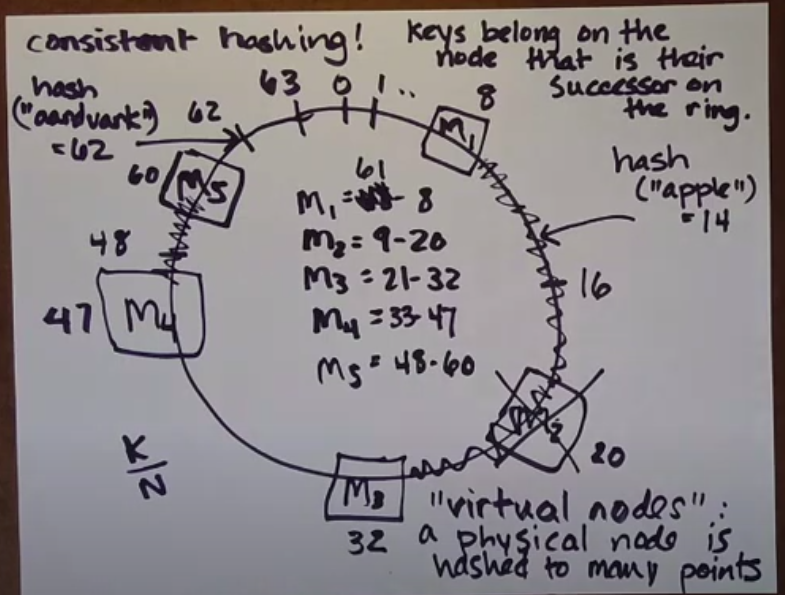

# Sharding (aka data partitioning)
- improving throughout
- storing lots of data





### Goals of a partitioning strategy
1. Evenly distribute the data
2. Make it fast and easy for the client to find the data he wants

## Partitioning methods
1. Random partitioning - good for evenly distribute the data, bad for fast and easy for the client to find the data
2. Not partitioning at all - good for fast and easy fot the client to find the data, bad for evenly distribute the data
3. Partitioning by key range - good for evenly distribute the data, bad for evenly distribute the data



4. Partitioning by hashed key mod n - there is a problem if we change the number of machines, mod of different n give us another result, so we will have to move the data to another machine



```
The trouble with partitioning by hash of key mod N: if N changes, we have to do unnecessary data movement
```

## Consistent hashing
Keys belong on the node that is their successor on the ring



Virtual node - a physical node is hashed to many points. One physical node can have many virtual nodes
