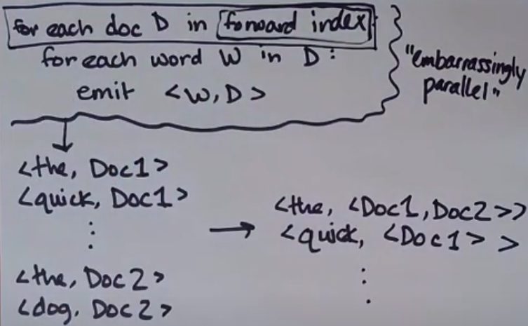
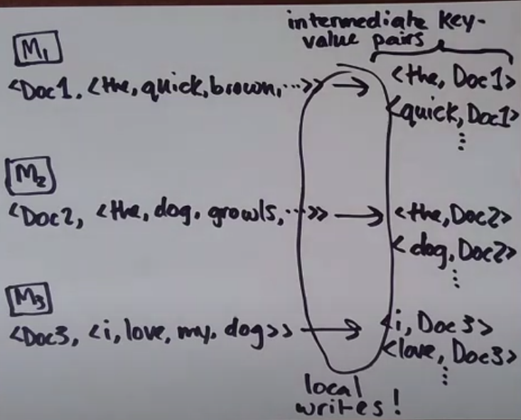
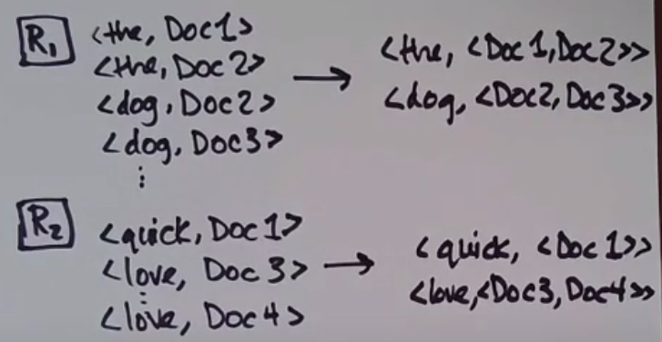
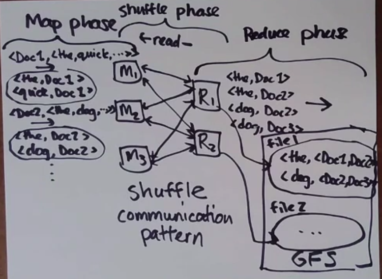

## Services or online systems
Wait for requests from clients and try to handle them quickly
(e.g. key-value store, web server, database, cache)

## Batch processing systems or offline systems
e.g MapReduce and its successors

### Raw data
Authoritative version

### Dervied data
Result of taking existing data and transforming/procesing it. MapReduce is a tool for computing derived data.

## MapReduce, how does it work?

Index - words in documents <Document -> Words>

Inverted index - documents which contain words <Word -> Documents>

Embarassingly parallel - every iteration in foreach is completely independent, it's really easy to do it parallel

### Parallel inverted index

Shuffle communication pattern

