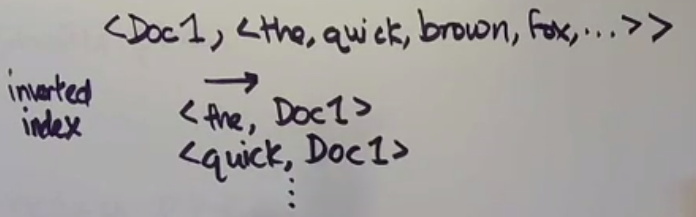
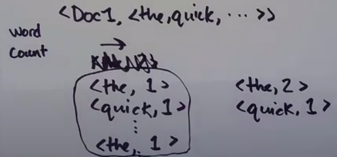
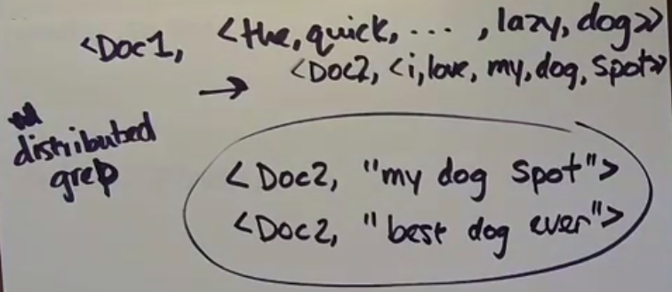
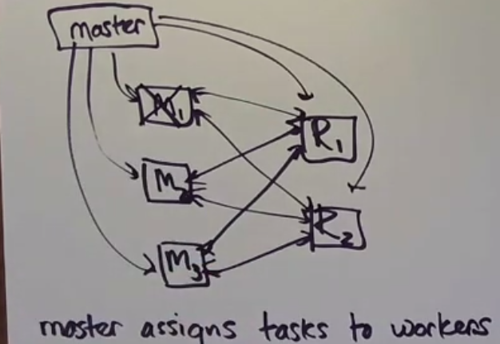

## MapReduce job phases
1. Map phase
- input key-value pair -> set of intermediate key-value pairs





2. Shuffle phase
- data goes from map workers into the appropriate reduce workers
- example of the partitioning function is 
```
hash(key) % number of reduce workers
```
This partition function is sufficient, because MapReduce is an offline system, so we don't have a problem with increasing amount of workers. Worker can die ofcourse, but MapReduce handle that situation with checkpoints.



If a map worker fails, all its work must be redone.

3. Reduce phase
- (key, set of values) -> set of output values


