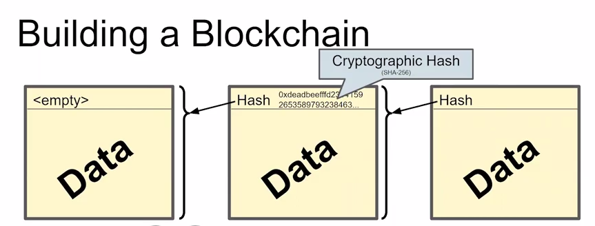
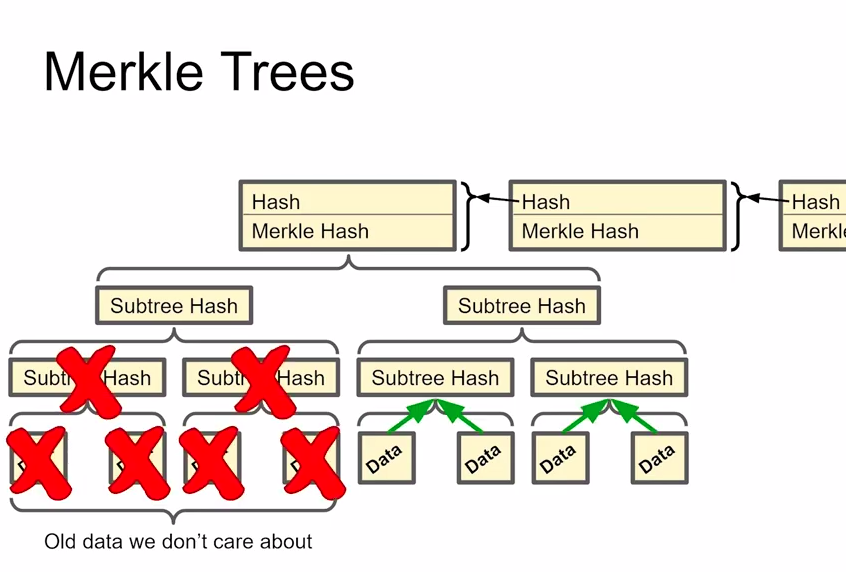
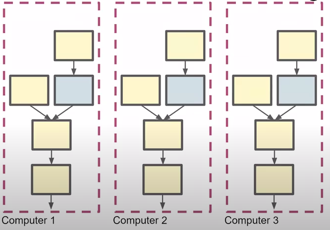
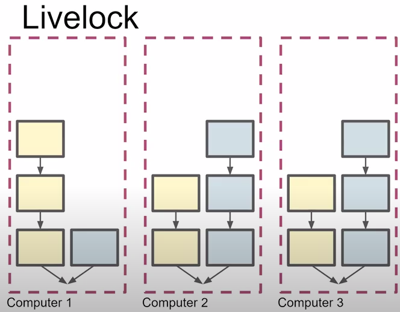
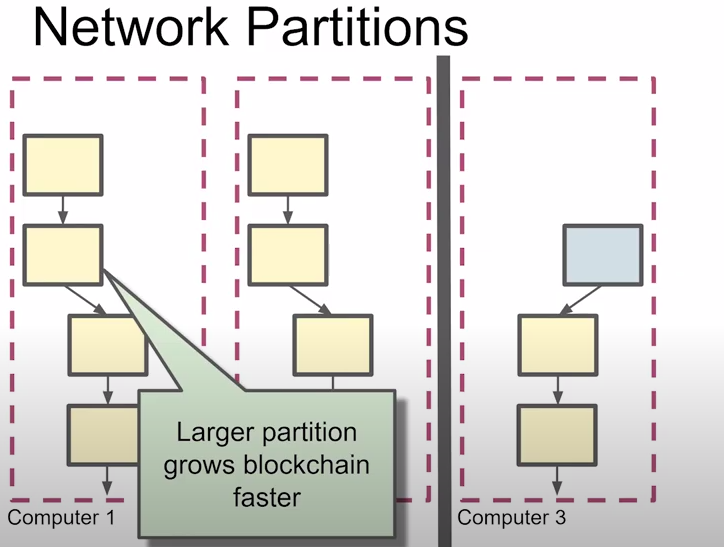
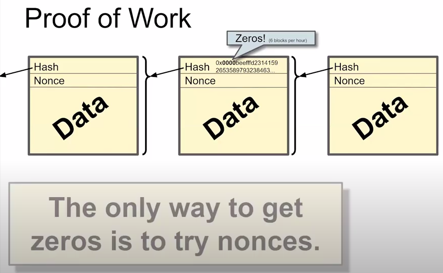

# Blockchain



To not download whole blockchain it's good to use merkle trees



### Consensus algorithms
- For normal life cases just use Paxos, Raft or Practical Byzantine Fault Tolerance (PBFT)
- Public blockchain
    - Any machine can join or leave at any time
    - Virtual machines let an attacker create an unlimited number of nodes

### Blockchain usecases
1. Private blockchain - it's used for group of organizations to have control on the data inside every organization. Every organization has its own copy of data and blockchain is used as a consensus algorithm. In most cases, there is no need to support dynamic membership. This is a big waste of resources (electricity, computer power, time, etc.). It's better to use PBFT for that kind of problems.
2. Public blockchain - the most important requirement is a supporting dynamic membership. You don't know how many nodes you will have.

## Bitcoin consensus
### Consensus requirements
1. New blocks eventaually replicated to all "good" nodes
2. Newer blocks point to this new block
3. Nodes can join or leave at any time
- While maintaining consensus
- Without causing deadlock
4. Network partition tolerant
- Each half forms a consensus
- When partition heals, so does the consensus
- This is weird!

#### Why this is weird
1. With other consensus protocols, you can poit at a node in the algorithm and say "this is the point where the all computers agree" (the commit point)
- Consensus is achieved. Full stop
2. Blockchain consensus is probabilistic
- "At this point we probably agree, at this later point we are more sure we agree, but we're never 100% sure"
- At any point a computing superpower can change your past consensus
    - But why wolud the?


### Strawman consensus algorithm
If two blocks are added to the blockchain in parallel, a fork is created. New block should be added to the longest fork. If the longest fork does not exist, node picks the fork randomly. Consensus is achieved when there is a fork with the longest chain and the fork exsists on every computer. Now that fork is a main blockchain.



### Livelock



#### How to solve livelock?
Problem: Why do we have livelock?
- Can add blocks faster than we learn about other blocks

Solution:
- Slow down adding blocks
- Sleep a random period of time before adding a block (random timeouts are also use on Paxos)

```
Using random timeouts is sometimes a good idea for resolving problems with concurrency conflict.
```

### Network Partitions



### Cheat resistant timer

1. Use cryptogtaphy (Trusted Computing Module) - Intel Sawtooth Blockchain can use Intel SGX. But you don't want to trust Intel, because it can be hacked
2. Proof of Work - The brute force way (Physics)
- to create a block, solve a math problem
    - need a problem that is impossible to solve quickly
    - include solution in the block
        - so others can verify you did it
    - verifying must be easy and fast



You have to count a nonce, then you need to count a hash of the previous block and the nonce to get a hash started with zeros. The number of zeros is a parameter.


