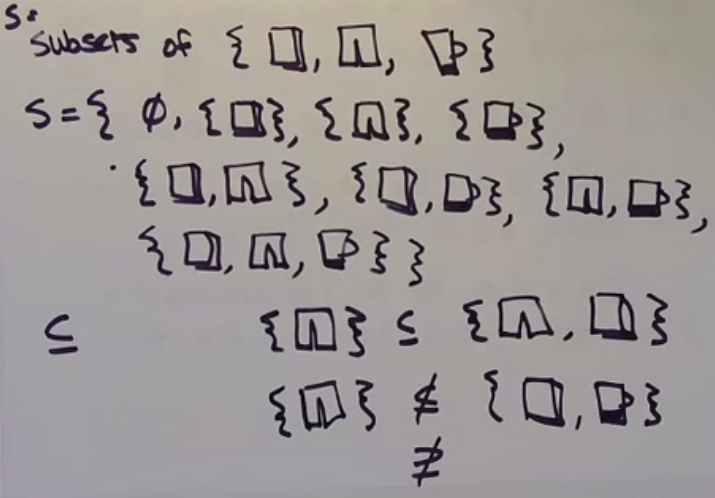
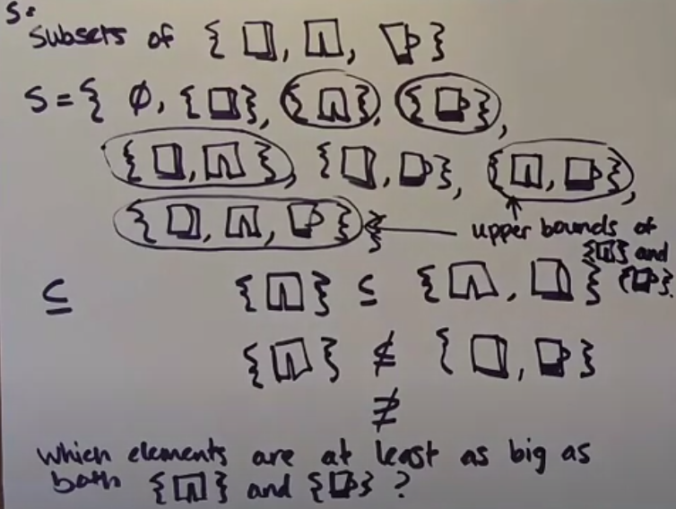

Using conesensus algorithm is really expensive. To agree about the order of two events using paxos we need minimum 8 messages. 


In most cases you don't need a strong consistency, strong convergence (replicas that have delivered the same set of updates have equivalent state) is good enough.

Partially ordered set - a set S, together with the binary relation <= with the following properties:
- reflexivity - for all a in S, a <= a
- antisymetry - for all a and b in S, if a <= b and b <= a, then a = b
- transitivity - for all a, b and c in S, if a <= b and b <= c, then a <= c



## Upper bounds

Which elements of S are at least as big as both pants and cup?



Given a partially ordered set (poset) (S, <=), an <em>upper bound</em> of a and b in S is an element u in S such that a <= u and b <= u.

Upper bounds of {pants} and {cup} is {pants, cup} and {pants, cap, book}

An upper bound of a and b in S is the <em>least upper bound</em> (lub), or join, if u <= v for each upper bound v of a and b.

The least upper bound of {pants} and {cup} is {pants, cup}.

A poset in which every 2 elements have a lub is called <em>join-semilattice</em>.

### What's a poset that is NOT a join-semilattice?

Boolean register (variable which can be empty, true, false)y
True and false doesn't have least upper bounds.


### Informal claim
If the states that replicas can take on can be thought of as elements of a join-semilattice, then there is a natural way of resolving conflicts between replicas WITHOUT consensus.

```
Conflict-free replicated data types (CRDTs)
```

### How to deal with removal?

1. Keep track of all of the elements in set that have been deleted


BUT there is a problem with readding something again. It's impossible.
