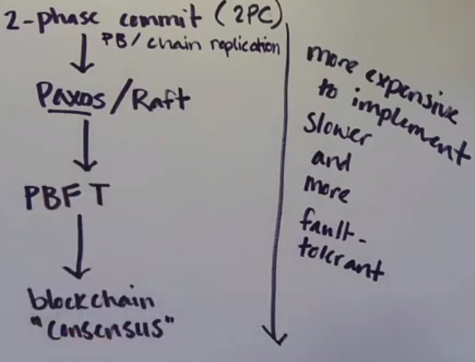
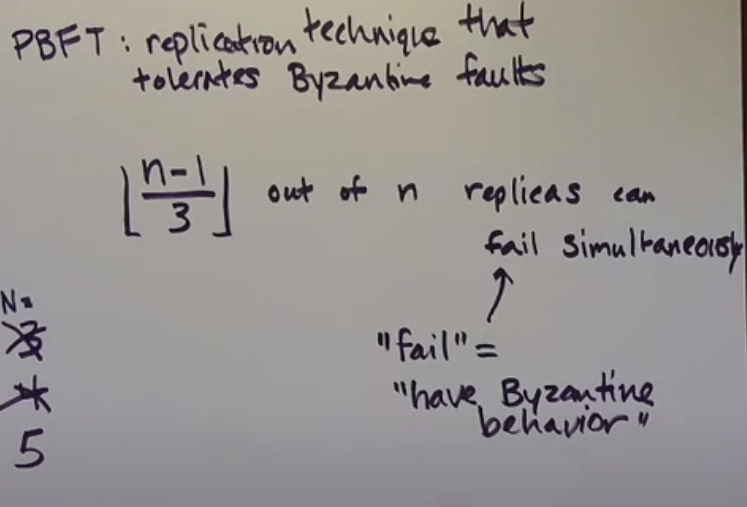

## Consensus algorithms



2PC, PAXOS
```
Consensus on transaction commit - Jim Gray and Leslie Lamport
```

PBFT
```
Practical Byzantine Fault Tolerance - Miguel Castro and Barbara Liskov
```



## Who invented vector clocks?

```
Time, Clocks, and the Ordering of Events in a Distributed System - Leslie Lamport
```

```
Detecting Causal Relationships in Distributed Computations: In Search of the Holy Grail - Reinhard Schwarz and Friedemann Mattern
```

```
Timestamps in Message-Passing Systems That Preserve the Partial Ordering - Colin J. Fidge
```

```
Virtual Time and Global States of Distributed Systems - Friedemann Mattern
```

```
Lightweight Causal and Atomic Group Multicast - Kenneth Birman, Andre Schiper, Pat Stephenson
```

```
Distributed Snapshots: Determining Global States of Distributed Systems - K. Mani Chandy and Leslie Lamport
```

```
RADOS: A Scalable, Reliable Storage Service for Petabyte-scale Storage Clusters - Sage A. Weil, Andrew W. Leung, Scott A. Brandt, Carlos Maltzahn
```

```
In Search of an Understandable COnsensus Algorithm (Extended Version) - Diego Ongaro and John Ousterhout
```

```
Viewstamped replication: A new primary copy method to support highly-available distributed systems - Brian M. Oki and Barbara H. Liskov
```

```
Vive la difference: Paxos vs Viewstamped replication vs Zab - Robert van Renesse, Nicolas Schiper, Fred B Schneider
```

```
Paxos vs Raft: Have we reached consensus on distributed consensus? - Heidi Howard and Richard Mortier
```
