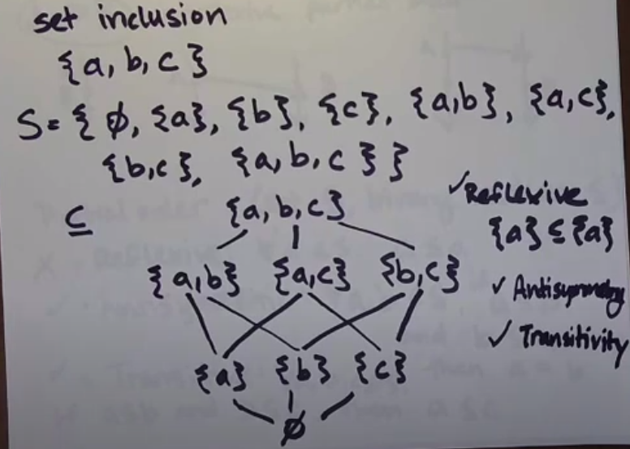
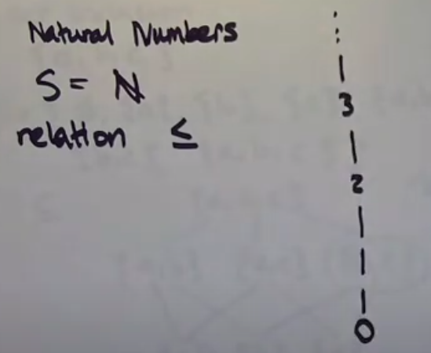
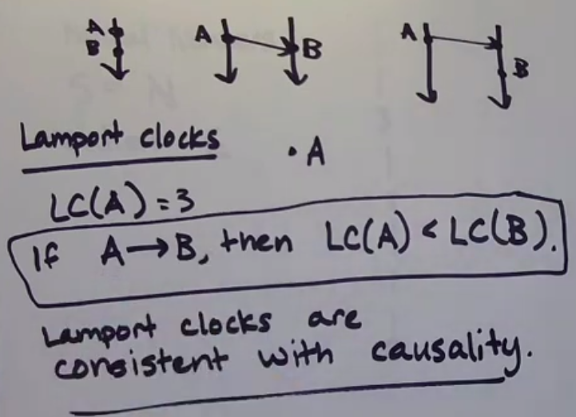
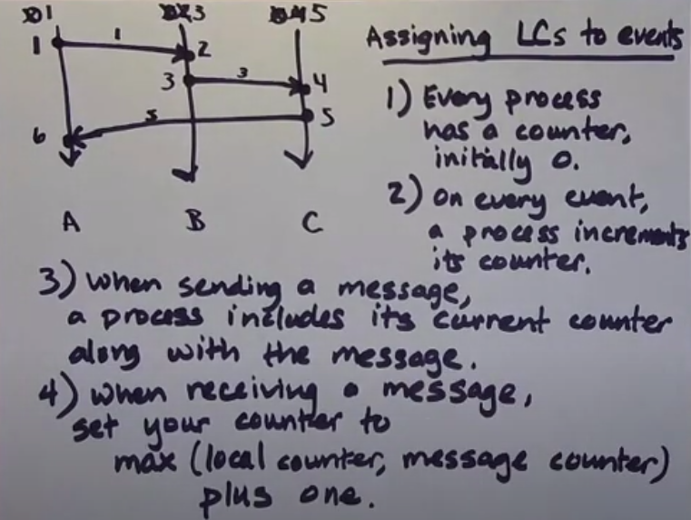
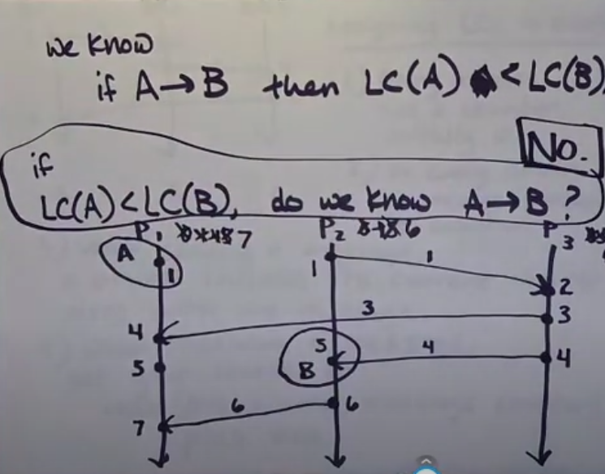
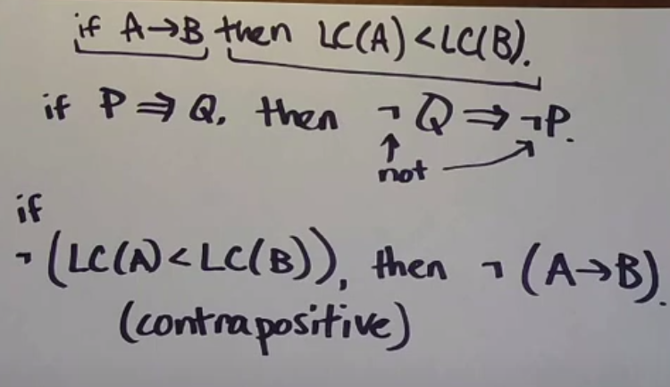

## Partial order

1. Reflexive - dla każdego <em>a</em> należacego do <em>S</em>, <em>a <= a</em>
2. Antisymetric - dla każdego <em>a</em> i <em>b</em> należacego do <em>S</em>, jeśli <em>a <= b</em> i <em>b <= a</em>, to <em>a = b</em>
3. Transitive - dla każdego <em>a</em>, <em>b</em> i <em>c</em> należacego do <em>S</em>, jeśli <em>a <= b</em> i <em>b <= c</em>, to <em>a <= c</em>

Relacja happens before nie jest przykładem partial order, ponieważ nie jest reflexive (nie ma sensu zdanie - jeżeli event A wydarzył się przed A to A jest eventem A).

Relacja happens before to irreflexive partial order.

### Set inclusion

Przykład partial order dla zbioru S = {a, b, c}



Zbiór {a} nie ma relacji ze zbiorem {b, c} w partial order.

#### Total order

Przykład - liczby naturalne




## Logical clocks

### Lamport clock



Podpinanie licznika z zegara do eventu

1. Każdy proces ma osobny licznik z wartością początkową 0.
2. Przy każdym evencie, licznik jest inkrementowany.
3. Podczas wysyłania wiadomości, proces dołącza obecną wartość licznika do wiadomości.
4. Podczas odbierania wiadomości, ustawia licznik odbiorcy wiadomości na 
```
Max(local counter, message counter) + 1
```
Dla wersji algorytmu, w której odebranie wiadomości nie jest zaliczane jako zdarzenie, wartość licznika nie jest inkrementowana (nie ma +1)



Zdanie - jeżeli A -> B to LC(A) < LC(B) jest prawdziwe.
</br>
Zdanie - jeżeli LC(A) < LC(B) to A -> B nie jest prawdziwe.



**Mimo, że LC(B) = 5, a LC(A) = 1, nie możemy powiedzieć, że A wystąpiło przed B.**

```
Causality is a graph reachability in spacetime.

Można powiedzieć, że zdarzenie A wydarzyło się przed zdarzeniem B, tylko jeżeli możemy połączyć ciągłą linia zdarzenie A i B.
```

!> Lamport clocks nie opisują przyczynowości (causality) zdarzeń - które z dwóch zdarzeń wystąpiło pierwsze.

#### Do czego można zastosować lamport clock

Twierdzenie odwrotne


Jeżeli LC(A) nie jest mniejsze niż LC(B), to wiemy, że A nie wydarzyło się przed B.

Dzięki temu, możemy użyć lamport clocks do debugowania. 

