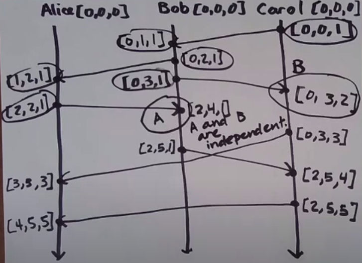

## Vector clock

[Detecting causal relationships in distributed computations: In search of the holy grail](https://link.springer.com/article/10.1007/BF02277859)

```
A -> B <=> VC(A) < VC(B)
```

Vector clock is consistent with and characterize causality.
Vector clock is a sequence of integers.

1. Every process maintains a vector of integers initialized to 0, one for each process. (e.g. for 3 processes [0,0,0])
2. On every event, a process increments its own position in its vector clock.
3. When sending a message, each process includes its current clock. (after incrementing its own position, because send is an event)
4. When receiving a message, each process updates its vector clock to the max of the received and local vector clocks. (after incrementing its own position, because receive is an event)


**Vector clocks work only in system with known amount of processes**

```
VC(A) < VC(B) when
VC(A)i <= VC(B)i for all i, and VC(A) != VC(B)

e.g.
VC(A) = [2, 2, 0]
VC(B) = [2, 3, 0]
VC(A) < VC(B)
```

Events A and B are concurrent (A || B) when 
```
VC(A) !< VC(B) (not less than)
VC(B) !< VC(a)

e.g.
VC(A) = [2, 2, 0]
VC(B) = [1, 2, 3]
A || B
```

