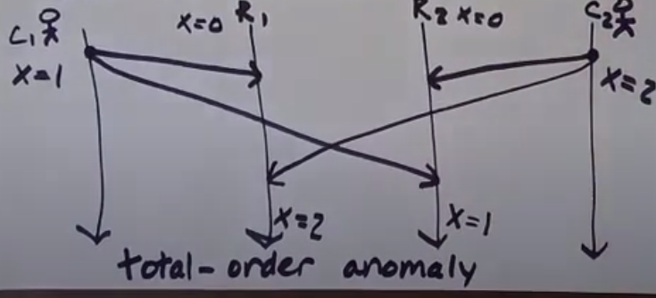
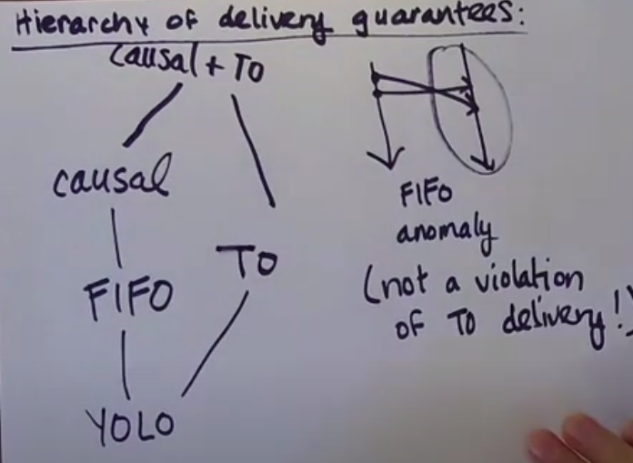
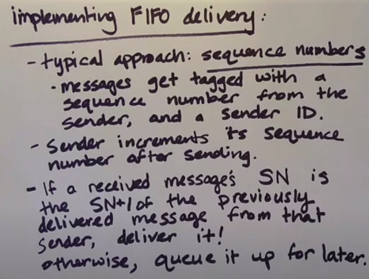
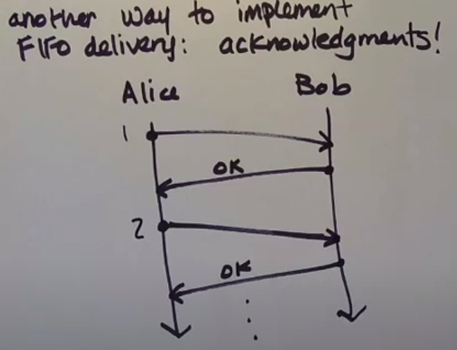
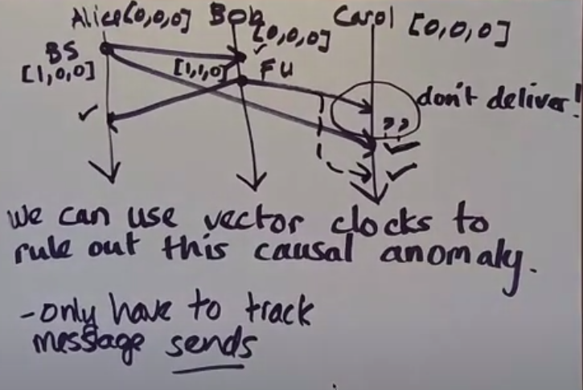

## Definitions

```
A set of rules that computers use to comunicate with each other.
```

### Receiving vs delivering of message
```
Delivering happens after receiving a message. Process has to decide whether the message should be available for viewing immediately or if it should be queued.
```

### FIFO delivery

```
if a one process sends message m2, after m1, then process delivering both delivers m1 first.
```

### Causal delivery

```
if m1's send happens before m2's send, then m1's delivery happens before m2's delivery
```

### Totally ordered delivery

```
if a process delivers message m1, than m2, then all processes delivering both m1 and m2 deliver m1 first
```

Total order anomally 

```
R1 is a replica 1
R2 is a replica 2
```

### Hierarchy of delivery guarantees


## FIFO delivery

1. Sequence numbers


Problems:
- Receiver is stuck when a message is lost. It works with reliable delivery.

2. Acknowledgments


Problems:
- It's slow

## Causal delivery

To rule out the causal anomaly, we can use vector clocks. We assume that the communication is a causal <strong>broadcast</strong> and delivery mechanism is reliable.



