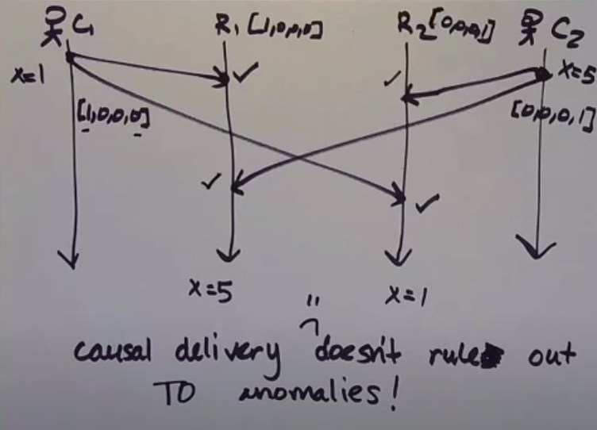
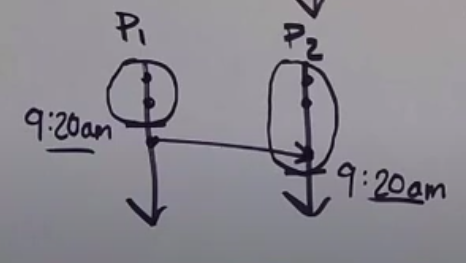
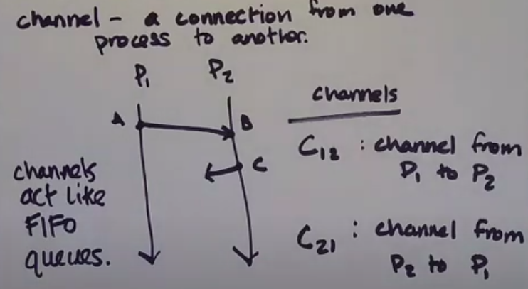

## Causal broadcast

1. if a message sent by process P1 is delivered at process P2, increment P2's local clock in the P1 position 
2. if a message is sent by a process, first increment its own position in its local clock and include the clock along with the message
3. a message sent by P1 is only delivered at P2 if, for the messages logical timestamp T (vector clock attached to message from P1):
    1. T[P1] = VC[P1] + 1
    2. T[Pk] <= VC[Pk], for all k != 1

**Causal delivery doesn't rule out total order anomalies**

## Potential causality

Ways that potential causality (->) is used in distributed systems:
1. Determine order of events after the fact (for debugging)
2. Causal ordering of events as they're happening
3. Consistent global snapshots (if A -> B and B is in the snapshot, then A should be, too) 

### Snapshoting

Phisical clocks are not good to schedule the snapshot for whole system, because they're not synchronized between processes.

### Chandy-Lamport algorithm

#### Channel - a connection between one process to another.

Assumption: Channels act like FIFO queues.

