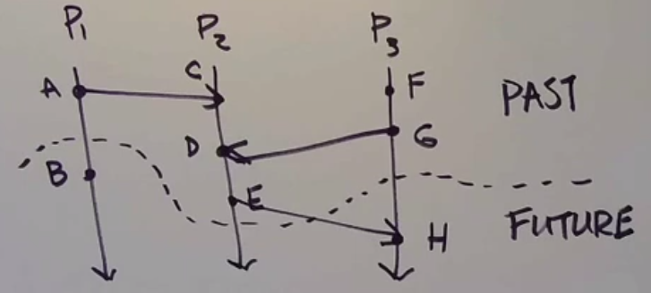
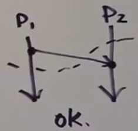
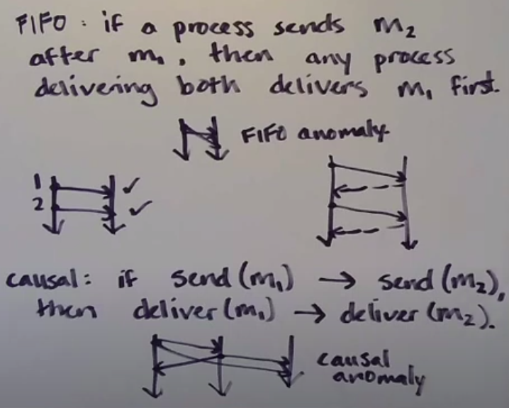
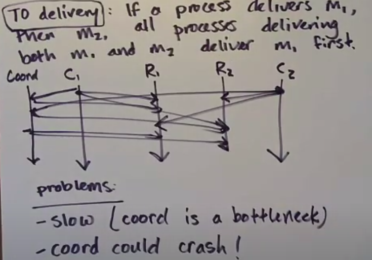

## Chandy-Lamport algorithm properties
1. Limitations
    - channels are FIFO
    - reliable delivery (no message loss/corruption/duplication)
    - process don't crash while the algorithm is running
2. Adventages
    - algorithm can run without stopping aplication
    - if the graph of processes is strongly connected (all processes are connected in one graph) algorithm will work concurrently and fast
    - multiple processes can be an initiators (you don't have to choose initiator and algorithm is faster)

### What are snapshot good for?
1. Checkpointing
2. Deadlock detection
3. Any stable property detection (property that once true, remains true)

## Causality in Chandy-Lamport algorithm

```
A 'cut' is a 'time frontier' going accros a Lamport diagram, dividing it into 'past' and 'future'
```

An event is in the cut if it is on the past side.


A cut is consistent when, for all events <em>E</em> that are in the cut, if <em>F -> E</em>, then <em>F</em> is also in the cut

Chandy-Lamport algorithm determines a consistent cut.



**Chandy-Lamport snapshots are causally correct**

## Summary




### Total order delivery protocol

1. Coordinator process 
    - it's really slow, because coordinator is a bottleneck
    - system stops if coordinator crash



FIFO, Causal, Total order deliveries describe how algorithms should behave.

1. Safety property - something bad won't happen. Protocol can be violated in a finite execution. FIFO, causal and total order deliveries are safety properties.
2. Liveness property - something good eventually happens