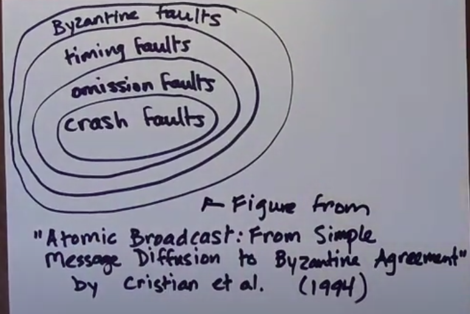
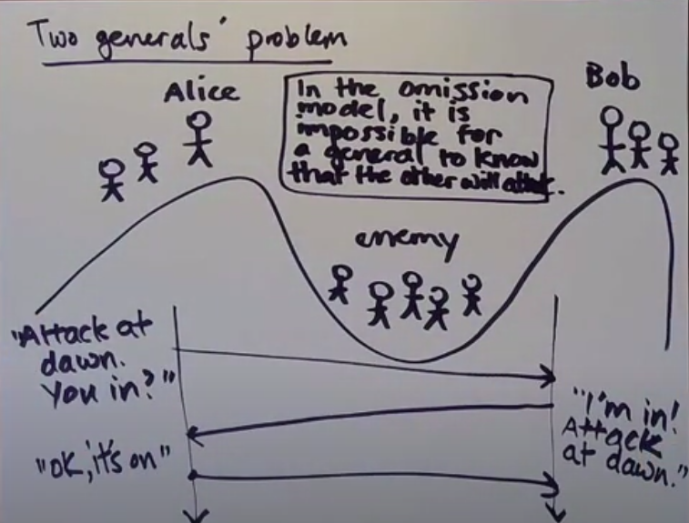

# Reliable delivery

Let P1 be a procces that sends a message m to process P2. If neither P1 nor P2 crashes, then P2 eventually delivers m.

## Fault models

### Types of faults

1. Omission fault
- Message from m1 to m2 or m2 to m1 gets lost
2. Timing fault
- Message from m1 to m2 or m2 to m1 is slow (channles is slow)
- M2 processes request too slow (process is slow)
3. Crash fault
- M2 crashes
4. Byzantium fault - malicious or arbitrary behaviour

### Hierarchy of faults

1. Byzantine fault - a process behaves in an arbitrary or even malicious way
2. Timing fault - a process responds too late (or too early)
3. Omission fault - a message is lost (a process fails to receive a message)
4. Crash fault - a process failt by halting (stops receiving or sending any messages)

#### Why hierarchy looks like this?

Crash fault is a special case of omission fault, where all messages to/from a process get lost after some point in time. Protocol which can handle omission faults also handles crash faults.

Omission fault is a special case of timing fault, where the message is infinitely slow.

Timing faults are a subset of byzantine faluts.



```
Good paper:
Atomic brodcast: from simple message diffusion to byzantine agreement
by Crisian et al. (1994)
```

Timing faults are not a part of the fault model in asynchronous system. Because in asynchronous system the timeout limit doesn't exist (Look at the definition of asynchronous system in section <em>Time and clocks</em>).

```
Fault model is a specification that specifies what kinds of faults a system may exhibit (and thus defines what kinds of faults are to be tolerated by the system)
```

### Two generals' problem

Alice and Bob must attack at the same time. So they must acknowledge receipt of the message, but they cannot be sure if the reciever recived the acknowledge message.


#### Workaround of the two generals' problem
1. Make a plan at advance (common knowledge). We say that there is common knowledge of some piece of information P when:
- everyone knows P
- everyone knows that everyone knows P
- everyone knows that everyone knows... that everyone knows P
2. You can increase generals' confidence about the attack if one of them will be sending a message in regular interval. The second one will send the acknowledge message and the first one will stop sending that message.